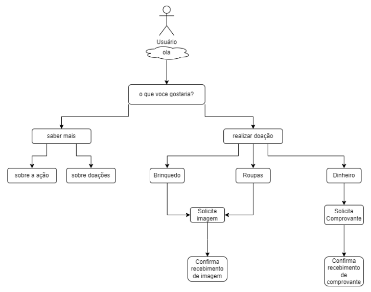
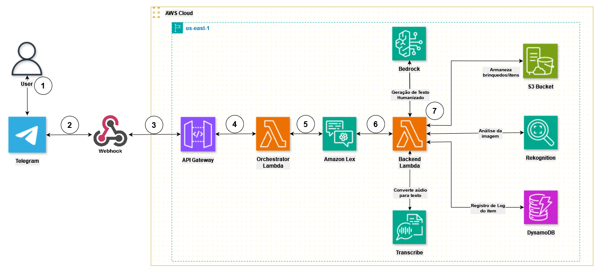

# Desenvolvimento da aplicação Natalino Bot

<!-- Terminar links-->
## 👨‍💻 Projeto desenvolvido por: [Felipe Pellissari](https://github.com/FeliPellissari), [Júlia Campos Nery](https://github.com/juliacamposn), [Lorena Valente Cavalheiro](https://github.com/Lorena-Valente-Cavalheiro), [Matheus Corniani](https://github.com/Cxrniani), [Rafael Torres Nantes](https://github.com/rafael-torres-nantes) e [Sarah Baraldi](https://github.com/mbaraldi-sarah).

## Índice

* [📚 Contextualização do projeto](#-contextualização-do-projeto)
* [🛠️ Tecnologias/Ferramentas utilizadas](#%EF%B8%8F-tecnologiasferramentas-utilizadas)
* [🖥️ Funcionamento do sistema](#%EF%B8%8F-funcionamento-do-sistema)
   * [💬 Parte 1 - Chatbot](#-parte-1---chatbot)
   * [🚂 Parte 2 - Reconhecimento de imagens](#-parte-2---reconhecimento-de-objetos)
   * [📝 Inserindo logs no DynamoDB](#%EF%B8%8F-inserindo-logs-no-dynamodb)
   * [🔀 Arquitetura da aplicação](#em-resumo-o-fluxo-da-aplicação-se-dá-da-seguinte-forma)
* [📁 Estrutura do projeto](#-estrutura-do-projeto)
* [📌 Como executar o projeto](#-como-executar-o-projeto)
* [🕵️ Dificuldades Encontradas](#%EF%B8%8F-dificuldades-encontradas)

<!--* [🔗 Endpoints](#-endpoints)-->

## 📚 Contextualização do projeto

O projeto tem o objetivo de **otimizar** e **automatizar** a comunicação e organização da ação social [**Natal dos Pequenos**](https://www.instagram.com/natal_dos_pequenos).

A ação consiste em **arrecadar** brinquedos, roupas, entre outros objetos, e/ou valores em dinheiro para a compra destes e **doá-los** a crianças em situação de vulnerabilidade social.

As doações de objetos são feitas diretamente para a equipe responsável pela ação ou em caixas espalhadas, geralmente, pela **Universidade Federal do Mato Grosso do Sul**. Já as doações em dinheiro são feitas via **pix**.

Para otimizar as doações, nossa equipe irá desenvolver um ***chatbot* humanizado** para o *Telegram* utilizando ***Amazon Lex***, ***Amazon Bedrock*** e ***Amazon Transcribe***. 

O *chatbot* informará sobre as **formas** de doação, **localização** das caixas, chaves **pix** e etc. Além disso, os doadores poderão enviar **fotos** dos objetos que desejam doar e o *bot* comunicará se os brinquedos estão em **boas** ou **más condições**.

Para fazer o reconhecimento dos objetos e seus estados de conservação, vamos utilizar o ***Amazon Rekognition*** e armazenaremos as imagens no ***AWS S3*** já classificadas como boas ou avariadas.

Além disso, armazenaremos *logs* no ***Amazon DynamoDB*** referentes aos objetos contendo suas características, seu estado de conservação.


## 🛠️ Tecnologias/Ferramentas utilizadas

[](https://code.visualstudio.com/)
[](https://git-scm.com/)
[](https://github.com/)

[](https://aws.amazon.com/pt/)
[](https://aws.amazon.com/pt/cli/)
[](https://aws.amazon.com/pt/s3/)
[](https://aws.amazon.com/pt/pm/dynamodb/)
[](https://aws.amazon.com/pt/bedrock/)
[](https://aws.amazon.com/pt/rekognition/)
[](https://aws.amazon.com/pt/transcribe/)

[](https://www.serverless.com)

[](https://www.instagram.com/)


#### Organização do Time:

[](https://www.microsoft.com/pt-br/microsoft-teams/group-chat-software)
[](https://trello.com/)
[](https://www.whatsapp.com/?lang=pt_BR)

## 🖥️ Funcionamento do sistema

### 💬 Parte 1 - Chatbot

Em nosso projeto, desenvolvemos um *chatbot* para informar possíveis doadores **sobre a ação** e **como doar**.

O *bot* é capaz de receber uma foto de um objeto para que seja **avaliado** se está ou não em condições de ser doado. Além de informar como fazer a **doação por pix**.

A relação entre os *intents* e seus *slots* está descrita na tabela abaixo:

| Intent                 | Slots                    |
|------------------------|-------------------------| 
| IntentApresentacao     | --                       |
| IntentDoar             | TipoDoacao               | 
| IntentInfo             | TipoInfo                 | 
| FallbackIntent         | --              |

Sendo assim, o fluxo de conversa do *chatbot* se dá por:



O chatbot conta com recursos do ***Amazon Bedrock*** e ***AWS Transcribe*** para se tornar mais humanizado.

#### Amazon Bedrock

O ***Amazon Bedrock*** é o respondável por criar mensagens amigáveis e humanizadas para o **Fallback**, assim como interpretar o texto transcrito de áudios recebidos, identificando a intenção do usuário.

<!-- Exemplo Terminar-->

#### AWS Transcribe

O ***AWS Transcribe*** permite que o possível doador mande áudio para o *bot*. O áudio é transcrito pela ferramenta e enviado ao *bot* como se fosse uma mensagem de texto. 

<!-- Exemplo Terminar-->

### 🚂 Parte 2 - Reconhecimento de Imagens

O reconhecimento de imagens é feito pelo Amazon Rekognition. Se concentrando em duas funções, *detect_labels* e *detect_text*:

- A função *detect_labels* é a principal, reconhecendo imagens e retornando *labels*.

```py
def detect_labels(self, bucket, image_name):
    """
    Detecta rótulos em uma imagem armazenada em um bucket do S3.

    :param bucket: Nome do bucket do S3 onde a imagem está armazenada.
    :param image_name: Nome do arquivo de imagem no bucket do S3.
    :return: Resposta da API detect_labels do Amazon Rekognition.
    """
    try:
        # Chama a API detect_labels do Amazon Rekognition
        response = self.rekognition.detect_labels(
            Image={
                'S3Object': {
                    'Bucket': bucket,
                    'Name': image_name
                }
            },
            MaxLabels=10,
            MinConfidence=80,
            Features=["GENERAL_LABELS", "IMAGE_PROPERTIES"],
            Settings={"ImageProperties": {"MaxDominantColors": 10}}
        )
        return response
    
    except BotoCoreError as e:
        # Em caso de erro, imprime a mensagem de erro e retorna None
        print(f"Erro ao detectar rótulos: {e}")
        return None
``` 

- Após a detecção inicial, **filtramos** as *labels* pra verificar a necessidade de usarmos a *detect_text*.

```py
def filter_rekogntion_labels(self, rekogntion_labels):
    """
    Filtra e atualiza os labels detectados com informações adicionais, se necessário.

    Parameters:
        rekogntion_labels (dict): Labels detectados pela função Rekognition.

    Returns:
        dict: Labels atualizados com informações adicionais, se necessário.
    """
    # Detectando textos na imagem
    if 'Page' in rekogntion_labels['item_name'] or 'Text and Documents' in rekogntion_labels['Categories']:
        response_text = self.rekognition_service.detect_text(self.api_bucket, self.object_name)
        info_text = extract_text_data_from_rekognition(response_text)
        rekogntion_labels['donation_type'] = info_text['donation_type']
        rekogntion_labels['donation_value'] = info_text['donation_value']

    # Atualiza o estado de conservação se detectado
    if 'Damage Detection' in rekogntion_labels['Categories']:
        rekogntion_labels['conservation_state'] = 'bad state'
    
    return rekogntion_labels
```

- Caso dentre as *labels* iniciais houver "*Text and Documents*", utilizamos a função *detect_text*. Essa função é utilizada para ler os **comprovantes de pix**:

```py
def detect_text(self, bucket, image_name):
    """
    Detecta texto em uma imagem armazenada em um bucket do S3.

    :param bucket: Nome do bucket do S3 onde a imagem está armazenada.
    :param image_name: Nome do arquivo de imagem no bucket do S3.
    :return: Lista de detecções de texto na imagem.
    """
    try:
        # Chama a API detect_text do Amazon Rekognition
        response = self.rekognition.detect_text(
            Image={
                'S3Object': {
                    'Bucket': bucket,
                    'Name': image_name
                }
            }
        )

        # Obtém as detecções de texto da resposta
        textDetections = response['TextDetections']
        return textDetections
    
    except BotoCoreError as e:
        # Em caso de erro, imprime a mensagem de erro e retorna None
        print(f"Erro ao detectar texto: {e}")
        return None
```

Ao final das detecções armeazenamos as imagens em um *bucket* ***S3***.

<!-- Terminar -->

### 📝 Inserindo logs no DynamoDBS

### Em resumo, o fluxo da aplicação se dá da seguinte forma:



## 📁 Estrutura do projeto 

#### O projeto foi dividido nos seguintes diretórios, baseando-se no modelo MVC (Model-View-Controller) com devidas adaptações:

```
└── 📁 sprints-9-10-pb-aws-marco
    └── 📁 assets 
    └── 📁 src
        └── 📁 controller
            └── app_controller.py
        └── 📁 services
            └── s3_service.py
            └── dynamodb_service.py
            └── rekognition_service.py
            └── bedrock_service.py
        └── 📁 utils
            └── utils.js
        └── handler.py
        └── requirements.txt
        └── serverless.yml    
    └── README
```

#### Divisão dos diretórios:

- `controller` → Realizam a chamada dos *services* (em ./services) criados para gerenciar os serviços AWS.

- `services` → Manipulam os serviços AWS.

- `utils` → Arquivos de utilidades, usados para checagem, testes e etc.

#### Outros arquivos importantes:

- `handler.py` → Contém as funções que sintetizam a API e define suas rotas. Verifica a saúde da API, recebe imagem e retorna os detalhes do reconhecimento do **Amazon Rekognition**.

- `serverless.yml` → Define as políticas **IAM** para permitir que as **funções Lambda** acessem os serviços necessários e rotas das requisições que serão usadas no *handler.py*. 


## 📌 Como executar o projeto

### Clone o repositório

```bash
$ git clone https://github.com/Compass-pb-aws-2024-MARCO/sprints-9-10-pb-aws-marco.git 
```

### Acesse a pasta do projeto no terminal/cmd:

```bash
$ cd sprints-8-pb-aws-marco
```

### Realize um check-out para a branch de desenvolvimento:

```bash
$ git checkout grupo-03
```

### Cerfitique-se ue tem o serverless instalado:

```bash
$ serverless
```

### Caso não estiver, instale poe meio do comando:

```bash
$ npm install -g serverless
```

### Instale os plugins do serverless:

```bash
$ npm install serverless-python-requirements serverless-dotenv-plugin
```

### Configure as credenciais da aws:

```bash
$ aws configure
```

### Faça login no serverless:

```bash
$ serverless login
```

<!-- Terminar -->

<!--
### Acesse a pasta visao-computacional:

```bash
$ cd visao-computacional
```

### Execute o seguinte comando para realizar o deploy:
```bash
$ serverless deploy
```
-->

<!--
## 🔗 Links de Teste

### Endpoints:


🔸 **GET** - https://fbpdfs3097.execute-api.us-east-1.amazonaws.com/

🔸 **GET** - https://fbpdfs3097.execute-api.us-east-1.amazonaws.com/v1

🔸 **GET** - https://fbpdfs3097.execute-api.us-east-1.amazonaws.com/v2

🔹 **POST** - https://fbpdfs3097.execute-api.us-east-1.amazonaws.com/v1/vision

🔹 **POST** - https://fbpdfs3097.execute-api.us-east-1.amazonaws.com/v2/vision

-->


## 🕵️ Dificuldades Encontradas

### ⚙ Dificuldades Técnicas

A integração dos serviços AWS causou nossas maiores dificuldades. Algumas ainda não foram totalmente resolvidas.

<!-- Terminar -->

### 📝 Dificuldades de Organização

<!-- Terminar  -->
